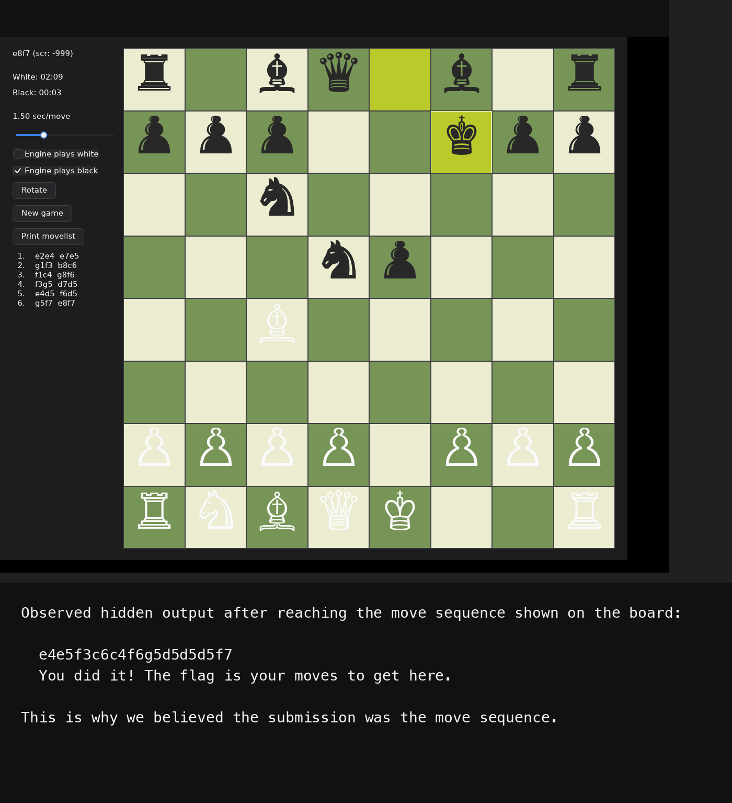

# checkmate-liver-king

## 문제 설명

> I found this interesting Chess game. It seems to run really slow. I wonder what secrets it holds?

- 제공 파일: `theliverking`

## 풀이

### 분석

문제 파일은 stripped Linux ELF였고, 내부 구현은 Go 바이너리였다.  
실행해 보면 체스 GUI가 뜨지만, 일반적인 체스 엔진 문제라기보다는 특정 수순에 도달했을 때 숨겨진 로직이 실행되는 구조였다.

처음에는 문자열과 함수 호출 흐름을 보면서 어떤 조건에서 별도 분기로 빠지는지 추적했다.  
분석 중 `CRYPTIFY_KEY`라는 문자열과 함께 XOR 기반 문자열 복호화 루틴을 찾을 수 있었고, 기본 키는 `xnasff3wcedj`였다.

직접 `objdump`로 확인한 복호화 루틴 일부는 다음과 같다.

```asm
a51020: pushq %rbp
a51021: pushq %r15
a51023: pushq %r14
a51025: pushq %r13
a51027: pushq %r12
a51029: pushq %rbx
a5102a: subq  $0x68, %rsp
a5102e: movq  %rdx, %r12
a51031: movq  %rsi, %r15
a51034: movq  %rdi, %r14
a51037: leaq  -0x6f8556(%rip), %rsi   # 0x358ae8
a5103e: movq  %rsp, %rdi
a51041: movl  $0xc, %edx
a51046: callq *0xcef054(%rip)         # 0x17400a0
a5104c: movq  0x8(%rsp), %r9
a51051: movq  0x10(%rsp), %r13
a51056: cmpl  $0x1, (%rsp)
a5105a: jne   0xa510c7
a51081: movabsq $0x7733666673616e78, %rax
a5108b: movq  %rax, (%rdi)
a5108e: movl  $0x6a646563, 0x8(%rdi)
```

여기서 `0x358ae8`는 `CRYPTIFY_KEY` 문자열이 있는 위치이고, 환경변수 키가 없을 때는 즉시값 `0x7733666673616e78`와 `0x6a646563`를 메모리에 써 넣는다.  
리틀엔디언으로 해석하면 각각 `xnasff3w`, `cedj`이므로 기본 키는 `xnasff3wcedj`가 된다.

숨은 체커로 진입하는 호출 지점도 분명하게 보인다.

```asm
9c9c40: leaq  0x18(%r15), %rsi
9c9c44: leaq  0x30(%rsp), %rdi
9c9c49: callq 0x9e0650
```

즉 현재 보드 상태를 담은 구조체 일부를 인자로 넘기고, `0x9e0650`에서 숨겨진 비교 루틴을 수행한다.

그 함수 내부에서는 암호화된 문자열 주소를 하나씩 꺼내 복호화하고, 현재 보드 상태와 비교한다.

```asm
9e06a7: leaq  -0x8aeda6(%rip), %rsi   # 0x131908
9e06ae: leaq  0x3e0(%rsp), %rdi
9e06b6: movl  $0x36, %edx
9e06bb: callq *0xd5f86f(%rip)         # 0x173ff30
9e06e7: callq 0x9e5700
9e06ec: testb %al, %al
9e06ee: je    0x9e0729

9e0806: leaq  -0x8aeecf(%rip), %rsi   # 0x13193e
9e080d: leaq  0x398(%rsp), %rdi
9e0815: movl  $0x31, %edx
9e081a: callq *0xd5f710(%rip)         # 0x173ff30
9e0839: callq 0x9e5700
9e083e: testb %al, %al
```

위 코드에서 `0x173ff30`은 문자열 복호화 함수 포인터이고, `0x131908`, `0x13193e` 같은 `.rodata` 주소들은 암호화된 FEN 문자열 블롭이다.  
복호화한 뒤 `0x9e5700`으로 비교하고, 일치하면 다음 분기로 넘어가는 식으로 여러 상태를 검사한다.

이 키로 숨겨진 문자열들을 복호화하면 일반 문구뿐 아니라 특정 보드 상태를 뜻하는 FEN 문자열들과 다음 문자열이 나온다.

```text
e4e5f3c6c4f6g5d5d5d5f7
You did it! The flag is your moves to get here.
```

여기서 바로 플래그를 제출하면 틀린다.  
핵심은 이 문자열이 "최종 정답"이 아니라, 숨겨진 루틴이 발동하는 시점까지의 이동 목적지들만 이어붙인 중간 단서라는 점이다.

복호화된 FEN들을 비교해 보면, 게임이 요구하는 라인은 전형적인 **Fried Liver Attack** 계열 수순이다.  
문제 제목이 `Checkmate, Liver King`인 것도 이 오프닝을 암시하는 힌트였다.

숨은 루틴이 요구하는 흐름은 다음과 같이 복원할 수 있었다.

```text
e2e4 e7e5
g1f3 b8c6
f1c4 g8f6
f3g5 d7d5
e4d5 f6d5
g5f7 e8f7
```

이 라인은 화면 왼쪽 `movelist`에도 그대로 찍힌다.  
즉 이 문제는 체스 엔진을 이기는 문제가 아니라, 특정 오프닝 지점까지 정확히 도달한 뒤 그 수순을 문제에서 원하는 방식으로 다시 인코딩하는 문제였다.



### 취약점

이 문제의 핵심 포인트는 두 가지였다.

첫째, 플래그가 직접 출력되지 않는다.  
특정 보드 상태에 도달하면 숨은 문자열 비교 루틴이 성공하면서 중간 단서만 출력된다.

둘째, 정답 포맷이 일반적인 UCI 수순(`e2e4`)이나 SAN(`Nxf7+`)이 아니라 **각 수의 도착 칸만 이어붙인 형태**였다.  
따라서 화면에 보이는 수순을 그대로 제출하면 안 되고, 다음처럼 변환해야 한다.

```text
e2e4 -> e4
e7e5 -> e5
g1f3 -> f3
b8c6 -> c6
f1c4 -> c4
g8f6 -> f6
f3g5 -> g5
d7d5 -> d5
e4d5 -> d5
f6d5 -> d5
g5f7 -> f7
e8f7 -> f7
```

### 익스플로잇

실제 풀이 흐름은 다음과 같았다.

1. 바이너리를 리버싱해서 XOR 문자열 복호화 루틴과 키 `xnasff3wcedj`를 찾는다.
2. 숨겨진 비교 문자열들을 복호화해서 특정 FEN 상태들과 `e4e5f3c6c4f6g5d5d5d5f7` 문자열을 얻는다.
3. 제목 힌트와 FEN 상태를 조합해서 요구 수순이 Fried Liver Attack 라인이라는 것을 확인한다.
4. 게임에서 실제로 다음 수순을 재현한다.

```text
e2e4 e7e5 g1f3 b8c6 f1c4 g8f6 f3g5 d7d5 e4d5 f6d5 g5f7 e8f7
```

5. 각 수의 도착 칸만 이어붙여 최종 제출 문자열을 만든다.

아래처럼 간단히 재구성할 수 있다.

```python
moves = [
    "e2e4", "e7e5",
    "g1f3", "b8c6",
    "f1c4", "g8f6",
    "f3g5", "d7d5",
    "e4d5", "f6d5",
    "g5f7", "e8f7",
]

answer = "".join(m[2:4] for m in moves)
print("DawgCTF{" + answer + "}")
```

이 스크립트의 출력은 다음과 같다.

```text
DawgCTF{e4e5f3c6c4f6g5d5d5d5f7f7}
```

여기서 한 번 헷갈리기 쉬운 부분이 있다.  
복호화로 얻은 문자열은 `e4e5f3c6c4f6g5d5d5d5f7`에서 끝나는데, 실제 정답은 마지막 `f7`가 하나 더 붙는다.

이유는 숨겨진 문자열이 `Nxf7`까지의 단서만 보여 주는 반면, 실제 화면의 `movelist`에는 마지막 검은색 응수 `e8f7`까지 포함되어 있기 때문이다.  
운영진 힌트대로 "정답은 스크린샷 안에" 있었고, 그래서 최종 답은 `...f7f7`로 끝난다.

## 플래그

```text
DawgCTF{e4e5f3c6c4f6g5d5d5d5f7f7}
```

## 배운 점

이 문제는 단순히 숨은 문자열을 복호화했다고 끝나는 유형이 아니었다.  
복호화 결과, 실제 보드 상태, 제목 힌트, 그리고 GUI에 보이는 move list의 표기 방식을 모두 합쳐야만 최종 제출 포맷이 완성됐다.

또한 리버싱 문제에서도 동적 실행이 매우 중요하다는 점을 다시 확인했다.  
문자열 하나만 믿고 제출했다면 계속 오답이 나왔고, 실제 GUI에서 어떤 시점에 어떤 수순이 찍히는지까지 확인해야 문제 의도를 제대로 읽을 수 있었다.
