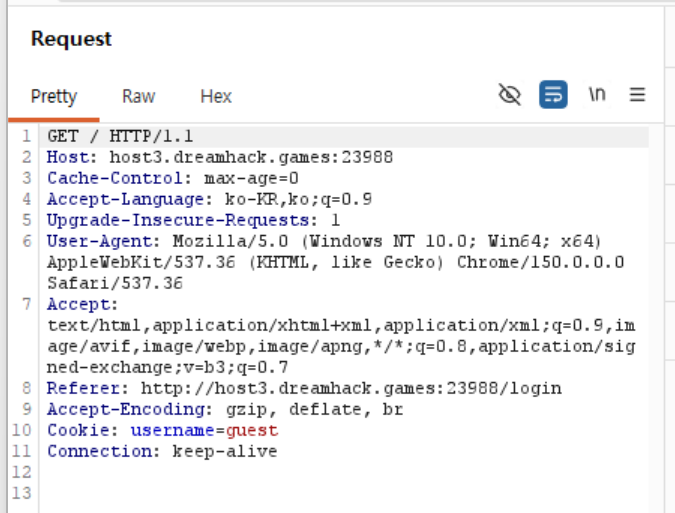

# Cookie

## 문제 설명

> 쿠키로 인증 상태를 관리하는 간단한 로그인 서비스입니다. admin 계정으로 로그인에 성공하면 플래그를 획득할 수 있습니다.

- 서버를 생성하여 접속 / 첨부파일 : app.py 

## 풀이

### 분석

flask 프레임워크를 통해 구현된, 로그인 기능을 가진 간단한 웹사이트이다.

`/` 페이지는 cookie에서 username을 가져와 username이 admin이면 FLAG를 출력한다.

`/login` 페이지에서는 username과 password를 입력하여 login할 수 있다.

이때 username이 guest 또는 admin이 아닌 경우 `not found user` alert가 발생한다.
guest의 비밀번호는 guest이고, admin의 비밀번호는 공개되어 있지 않다.


### 취약점

pw == password인 경우, 즉 저장된 비밀번호 값과 입력한 값이 같을 경우 로그인에 성공한다. 이때 `/` 페이지로 리다이렉트되며 cookie 값에 username이 설정된다.

서버는 별다른 검증 없이 요청에 포함된 cookie를 신뢰하고 이를 이용하여 이용자를 식별하므로 cookie 값의 username을 admin으로 변경하면 FLAG를 획득할 수 있다.


### 익스플로잇

1. guest 계정으로 로그인한다.
2. `GET /` 요청을 intercept하여 `Cookie: username=guest`에서 username을 admin으로 변경한다.

    

3. response에서 플래그를 획득한다.

## 플래그

```
DH{REDACTED}
```

## 배운 점

- HTTP는 Connectionless와 Stateless 특성을 가지며 이를 보완하기 위해 쿠키와 세션을 이용한다.
    - Connectionless: 하나의 요청에 하나의 응답 후 연결을 종료한다.
    - Stateless: 통신이 끝난 후 상태 정보를 저장하지 않는다.
- Cookie는 Key와 Value로 이루어지며, 클라이언트의 인증 정보를 포함한다.
    - 서버가 클라이언트에게 쿠키를 발급하고, 쿠키는 클라이언트에 저장된다. 이후 클라이언트가 서버에 요청을 보낼 때 쿠키를 Request Header에 넣어 같이 전송한다. 서버는 요청에 포함된 쿠키를 확인함으로써 클라이언트를 구분할 수 있다.
    - 쿠키를 설정할 때에는 만료 시간을 지정할 수 있고, 만료 시간 이후에는 쿠키가 삭제된다. 이는 클라이언트(브라우저)에서 관리된다.
    - 쿠키를 변조하여 요청을 보냄으로써 다른 사용자로 전환하거나 권한 상승이 가능하며, 쿠키의 사용자 식별 값이 평문으로 노출될 경우 다른 사용자의 유효한 세션 탈취가 가능하다.
- Session은 쿠키에 포함된 Session ID를 이용해 서버에 저장된 세션 데이터에 접근하는 방식이다.
    - 세션은 인증 정보를 서버에 저장하고, 랜덤한 키를 클라이언트에 발급한다. 이후 클라이언트는 해당 키를 포함하여 서버에 요청을 보낸다. 서버는 저장한 세션 키와 대응하는 클라이언트인지 확인하여 보다 안전한 서비스를 구현할 수 있다.