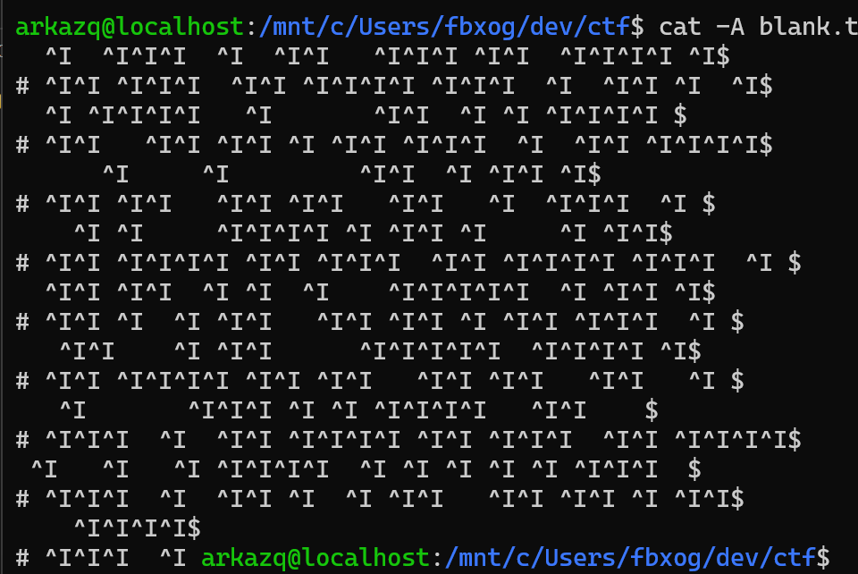
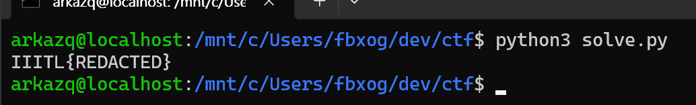

# Blank

## 1. 개요 및 분석 방향

CTF에서 문제명이 따로 표시되지 않았는데, 풀이 이후 공백과 관련된 문제라 대회 측에서 의도한 연출로 판단된다. 문제 명이 따로 주어지지 않아 편의상 `Blank`라는 제목을 사용했다.

문제 설명에서 해당 파일은 이상한 문자나 암호화 등이 없다 하며 `“The loudest secrets are often hidden in silence.”` 이와 같은 문구가 존재하였다. 주어진 `blank.txt`파일을 열어보았을 때, 몇 개의 `#`외에는 아무것도 보이지 않아 공백이나 탭같은 보이지 않는 문자에 관한 문제임을 유추할 수 있었다.



## 2. 풀이 과정

출력된 결과를 확인하니, `#`을 제외하면 마지막 두 줄 제외하면 각 줄마다 공백과 탭의 개수의 합이 32임을 확인할 수 있었다.

- `space -> 0`
- `tab -> 1`

이렇게 각 줄을 비트열로 바꿔 8bit 씩 ASCII로 변환하여 확인해 보니, 의미를 알 수 없는 문자열이 대부분이었다. 모든 줄이 한 줄씩 따로 해석하면 의미 있는 문자열이 나오지 않았기에 어떤 식으로 접근해야 할지 생각을 해보니, 모든 문자열이 유효한 값이라면 플래그가 너무 길 것이라 판단해 #을 기준으로 인접한 두 줄을 xor 하는 시도를 해보았다.

이 방식으로 각 쌍을 복원하면 플래그 형식에 맞는 문자열이 이어졌고, 전체를 이어 붙여 최종 플래그를 얻을 수 있었다.

풀이 당시에는 웹에서 xor calculator를 사용하였지만, 자동화를 위해 [solve.py](./solve.py)를 짜보았다.

## 3. 실행 및 플래그 획득

```bash
python3 solve.py
```

위 스크립트를 실행하면 플래그를 복원할 수 있다. 마스킹을 위해 플래그는 출력하지 않았다.



최종 플래그:

```text
IIITL{REDACTED}
```
