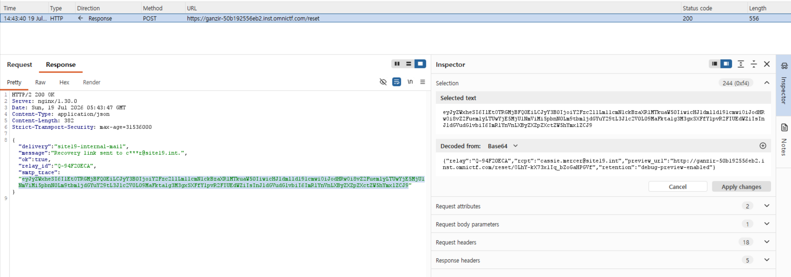
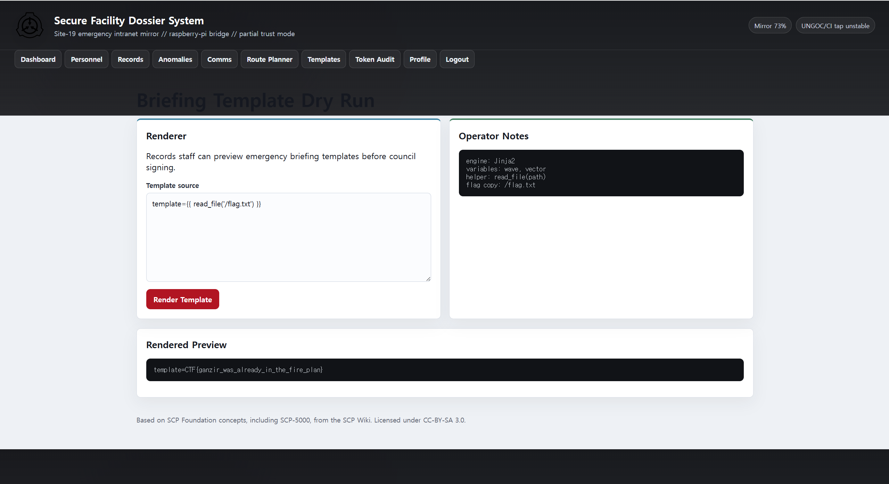

# Ganzir

## 문제 설명

> Just a normal web app. Go away!!!!

- Start instance를 통해 웹사이트에 접속한다. SCP 재단 콘셉트의 웹 애플리케이션이며, 로그인/직원 페이지/템플릿 렌더링 기능이 존재한다.

## 풀이

### 분석

메인 페이지에 접속하면 /login, /employee 페이지로 이동할 수 있다.
 
- /login 페이지

    Cassie라는 Records 직원이 언급되어 있고, /reset 페이지에서 cassie 계정 복구를 시도할 수 있다.

    /reset에 username=cassie를 보내면 응답에 smtp_trace라는 base64 값이 포함되어 있다. 이를 디코딩하면 서버가 해당 사용자에게 발송하는 메일 내에 포함되는, 비밀번호 재설정 링크가 `preview URL` 값으로 노출된다. (username을 Cassie로 입력하는 경우 일반적인 응답만 나오고, cassie라고 입력해야 내부 메일 정보를 추가로 얻을 수 있다.)

    {
        "relay":"Q-94F20ECA",
        "rcpt": "cassie.mercer@site19.int",
        "preview_url": "http://.../reset/<token>",
        "retention": "debug-preview-enabled"
    }

    이 preview URL을 통해 Cassie 계정의 비밀번호를 재설정하고 로그인할 수 있다.

### 취약점

1. 계정 복구 디버그 정보 노출

/reset 페이지에서 실제 계정인 cassie에게 전송되는 비밀번호 재설정 URL이 smtp_trace에 노출된다. 이 값은 base64로만 인코딩되어 있어 쉽게 복구 링크를 얻을 수 있다.

2. Jinja2 SSTI 및 파일 읽기 helper 노출

직원 세션 획득 후 /briefing-template 페이지에 접근하면 아래 Operator Notes를 확인할 수 있다. read_file(path) helper와 /flag.txt 위치가 노출되어 있다.
```
engine: Jinja2
variables: wave, vector
helper: read_file(path)
flag copy: /flag.txt
```

### 익스플로잇

1. Cassie 계정 복구 요청 및 비밀번호 재설정

    /reset 페이지에서 username에 cassie를 입력하고 Burp Suite로 응답을 확인한다. 응답에서 smtp_trace를 base64 디코딩하면 reset preview URL을 얻을 수 있다. 해당 링크로 비밀번호를 재설정하여 cassie로 로그인한다.
    

2. Jinja2 템플릿으로 플래그 읽기

    /briefing-template 페이지에서 Template source 칸에 `template={{ read_file('/flag.txt') }}`을 입력하고 Render Template 버튼을 클릭하면 렌더링 결과에 flag가 출력된다.
    

## 플래그

```
CTF{REDACTED}
```

## 배운 점

- 계정 복구 기능에서 디버그 정보나 preview URL이 노출되면 계정 탈취로 이어질 수 있다.
- 파일 읽기 helper 같은 위험한 함수가 노출되면 SSTI를 통해 민감 파일을 읽을 수 있다.
- SSTI(Server-Side Template Injection)는 웹 서버가 템플릿 문법을 해석해서 HTML을 만들 때, 사용자가 넣은 입력이 서버에서 템플릿 코드로 실행되는 것을 의미한다.
- Jinja2는 Python에서 많이 쓰는 템플릿 엔진이며, {{ ... }}는 Jinja2에서 값을 계산하거나 출력하는 문법이다.