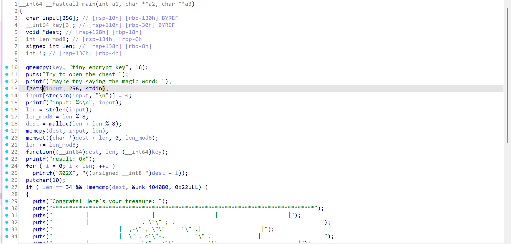
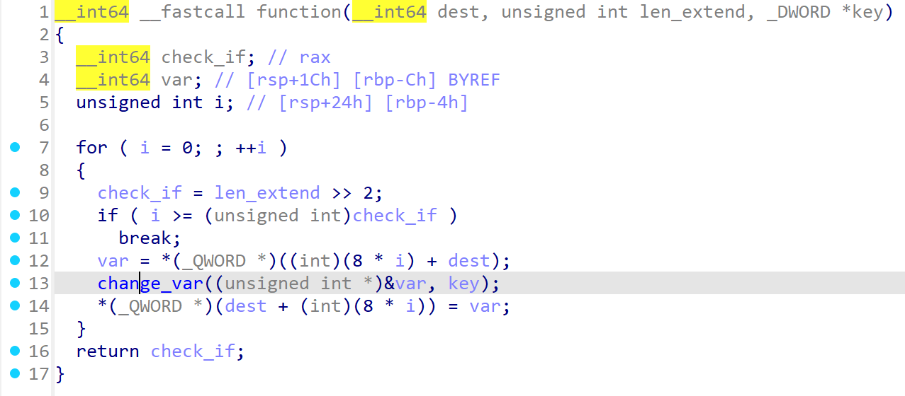
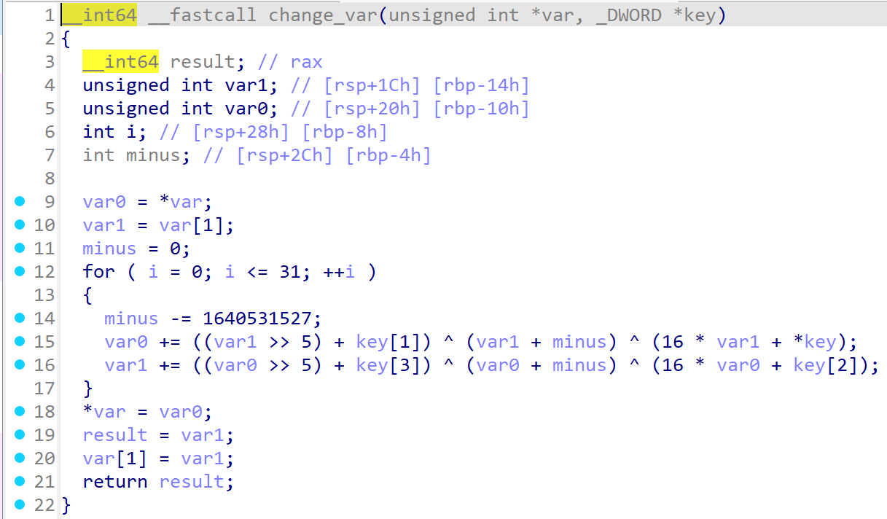

# 문제명

`t-reasure-chest`

## 문제 설명

> Score! You found a treasure chest! Now if only you could figure out how to unlock it... maybe there's a magic word?

보물 상자를 찾았지만 잠겨 있다. 입력창에 올바른 "magic word"를 넣어 상자를 열어야 하는 리버싱 문제다.

- 문제 파일 다운로드 버튼으로 `treasure` 바이너리가 제공된다.
- 입력값을 넣고 `PLUNDER!` 버튼을 눌러 정답 여부를 확인할 수 있다.

- 문제 파일: `treasure`

## 풀이

IDA로 디컴파일한 뒤, 분석을 용이하게 하기 위해 새로운 C 파일로 복원하였다.
해당 파일은 `t-reasure-chest.c`이다.

해당 파일을 바탕으로 복호화 C 파일을 만들었다.
해당 파일은 `decoded.c`이다.

### 분석

`treasure` 파일은 `main()` 함수에서 사용자 입력값을 받는다.
이 사용자 입력값의 길이를 저장하고, 그에 맞게 동적 메모리를 할당한다.
동적 메모리 `dest`, 입력값 길이, 내부에 저장된 `key`를 `function()` 함수에 매개변수로서 전달한다.

`function()` 함수는 `dest`를 8바이트 블록 단위로 읽어 `change_var()`에 전달한다.

`change_var()` 함수는 64비트 블록을 두 개의 32비트 값으로 나누어 `key`와 `sum`을 이용한 반복 연산을 수행한다.

위와 같은 과정을 진행한 후 변형된 `dest` 배열과 내부에 저장된 `table`을 비교하고 입력값의 길이를 검증하여 조건에 맞으면 성공 메시지를 출력한다.

### 핵심 아이디어

F(x, y) = ((x >> 5) + key[1]) ^ (x + y) ^ (16 * x + key[0])
G(x, y) = ((x >> 5) + key[3]) ^ (x + y) ^ (16 * x + key[2])
이라고 하자.

`var0 += ((var1 >> 5) + key[1]) ^ (var1 + sum) ^ (16 * var1 + key[0]);`
`var1 += ((var0 >> 5) + key[3]) ^ (var0 + sum) ^ (16 * var0 + key[2]);`
위 두 식을
`v0' = v0 + F(v1, sum), v0 = v0' - F(v1, sum)`
`v1' = v1 + G(v0', sum), v1 = v1' - G(v0', sum)`
이라고 표현할 수 있다.

이러한 연산을 통해 올바른 정답 테이블을 이용하여 올바른 사용자 입력값을 알아낼 수 있다.

### Solve

`main()` 함수에서는 내장된 정답 `table`과 `key`를 `function()` 함수에 매개변수로서 전달한다.

`function()` 함수에서 `table`의 각 값들과 `key`를 `change_var()` 함수에 매개변수로서 전달한다.

`change_var()` 함수에서 위에 기술한 식의 `v0`와 `v1`을 구하는 역산을 진행한다.

`change_var()` 함수의 역연산 버전은 아래와 같다.

```c
void change_var(unsigned int *var, unsigned int *key)
{
        unsigned int var1;
        unsigned int var0;
        unsigned int sum;

        var0 = var[0];
        var1 = var[1];
        sum = -1640531527U * 32U;

        for (int i = 0; i < 32; i++)
        {
                var1 -= ((var0 >> 5) + key[3]) ^ (var0 + sum) ^ (16 * var0 + key[2]);
                var0 -= ((var1 >> 5) + key[1]) ^ (var1 + sum) ^ (16 * var1 + key[0]);
                sum += 1640531527U;
        }

        var[0] = var0;
        var[1] = var1;

        return;
}

```

## 플래그

```
최종적으로 사용자가 입력해야할 올바른 flag를 획득할 수 있었다.
RS{REDACTED}
```

## 추가 파일

- 디컴파일 결과를 정리한 C 코드 : [`t-reasure-chest.c`](t-reasure-chest.c)

- 정답 테이블을 이용해 역연산을 수행하는 복호화 코드 : [`t-reasure-chest.c`](t-reasure-chest.c)

## 참고 이미지

### `main()` 디컴파일 결과


### `function()` 디컴파일 결과


### `change_var()` 디컴파일 결과


## 배운 점

처음에는 `(var0 >> 5)` 연산을 보고, 비트가 손실되는 연산을 어떻게 복원할 수 있는지 의문이 들었다.
하지만 이를 `F(x, y)`와 `G(x, y)` 형태로 정리해 보니, 필요한 값들이 모두 주어져 있는 상태이므로 역연산이 가능하다는 점을 확인할 수 있었다.
