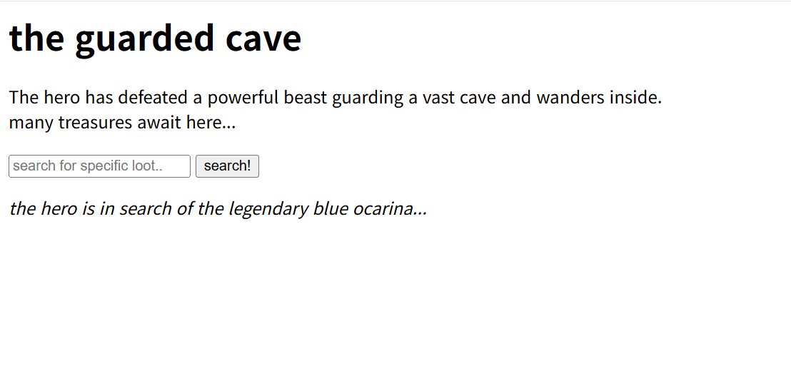

# Explore The Cave

## 문제 설명

> A beast once guarded this cave, but the treasure inventory is still hiding something legendary. Can you find the blue ocarina?

- 주어진 링크를 통해 문제 인스턴스를 생성할 수 있다.
- 첨부파일: `app.py`, `Dockerfile`, `requirements.txt`, `.dockerignore`

## 풀이

### 분석

해당 문제는 Flask와 sqlite3를 이용해 구현된 간단한 웹 애플리케이션이다. 사용자는 검색 기능을 통해 데이터베이스에 저장된 보물 목록을 조회할 수 있으며, 서버는 HTML 템플릿을 렌더링하여 결과를 반환한다.

문제 설명에서는 `blue ocarina`를 찾아야 한다고 안내하고 있다.



검색창에 문자열을 입력하면 `GET /search?q=` 요청이 전송되고, 입력한 문자열이 포함된 항목만 결과로 출력된다. 이때 검색값으로 `' --`를 입력하면 데이터베이스에 저장된 항목들이 모두 출력되는 것을 확인할 수 있었다. 이를 통해 SQL Injection 취약점이 존재한다고 판단하였다.

### 취약점 분석

`GET /search` 엔드포인트에서는 사용자가 전달한 `q` 파라미터를 별도의 검증이나 파라미터 바인딩 없이 SQL 쿼리 문자열에 직접 삽입한다.

```python
query = (
    "SELECT item_count, item, description FROM main_cave "
    f"WHERE item_count LIKE '%{term}%' "
    f"OR item LIKE '%{term}%' "
    f"OR description LIKE '%{term}%' "
    "ORDER BY item"
)
```

이처럼 사용자 입력이 f-string을 통해 쿼리에 직접 포함되기 때문에, 공격자는 입력값을 조작하여 기존 쿼리의 조건문을 변경하거나 `UNION SELECT`를 이용해 다른 테이블의 데이터를 조회할 수 있다.

### 익스플로잇

첨부된 `app.py`를 확인하면 플래그는 `secret_opening` 테이블에 저장되어 있다. 기존 쿼리는 `item_count`, `item`, `description` 세 개의 컬럼을 조회하므로, 동일하게 세 개의 컬럼을 반환하는 `UNION SELECT` 구문을 구성하면 `secret_opening` 테이블의 내용을 함께 출력할 수 있다.

```sql
' UNION SELECT * FROM secret_opening --
```

위 페이로드를 검색창에 입력하면 기존 `main_cave` 조회 결과에 `secret_opening` 테이블의 결과가 합쳐져 출력된다. 출력 결과에서 `blue ocarina` 항목과 함께 플래그를 확인할 수 있다.

## 플래그

```
uiuctf{REDACTED}
```

## 배운 점

- 사용자 입력값을 SQL 쿼리에 직접 삽입하면 SQL Injection 취약점이 발생할 수 있다. 이를 방지하기 위해서는 f-string이나 문자열 연결 방식으로 쿼리를 구성하지 않고, 파라미터 바인딩을 사용하여 사용자 입력과 SQL 문법을 분리해야 한다.
