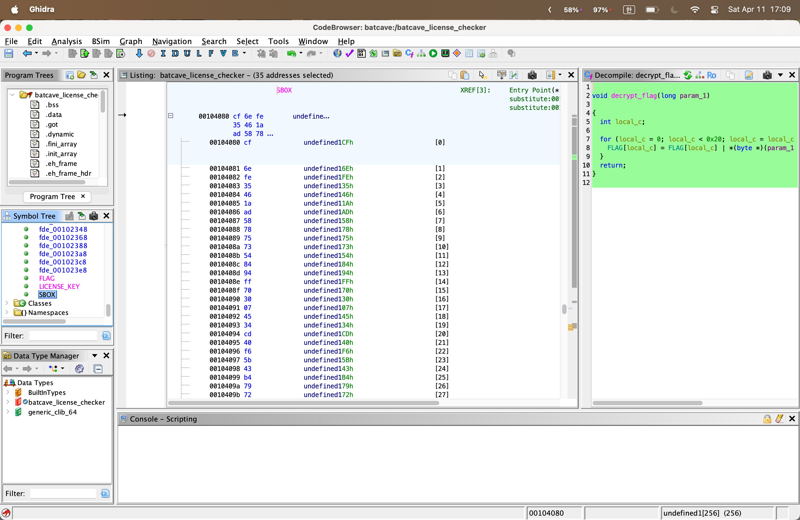

# Batcave Bitflips

## 문제 개요

배트맨 라이센스 검증 프로그램이다. cosmic ray로 인해 바이너리에 3개의 비트가 뒤집혔고, 그 결과 정상적으로는 플래그가 나오지 않는다. 3개의 버그를 찾아 올바른 플래그를 복원하는 것이 목표.

힌트: rotation, SBOX가 이상하다.

- **카테고리**: rev / medium
- **점수**: 100
- **파일**: `batcave_license_checker` (ELF 64-bit, x86-64, not stripped)

## 1. 초기 정찰

### 1.1 파일 타입 확인

```bash
$ file batcave_license_checker
batcave_license_checker: ELF 64-bit LSB pie executable, x86-64, ...
                         dynamically linked, ..., not stripped
```

`not stripped`는 큰 행운이다. 함수/심볼 이름이 그대로 살아있다는 뜻이다.

### 1.2 문자열 추출

```bash
$ strings batcave_license_checker
...
ENTER LICENSE KEY:
COMPUTING...
HASHED KEY: %s
VERIFYING...
INVALID LICENSE - PLEASE CONTACT ALFRED
LICENSE GOOD - DECRYPTING BAT DATA...
FLAG: %s
!_batman-robin-alfred_((67||67));
0123456789abcdef
decrypt_flag
expand_state
hash
SBOX
bytes_to_hex
FLAG
derive_final
rotate
LICENSE_KEY
verify
substitute
EXPECTED
```

여기서 거의 모든 단서가 나온다:

- 함수 이름들이 그대로 보인다 → 프로그램 구조를 추측할 수 있다
- `!_batman-robin-alfred_((67||67));` ← 라이센스 키처럼 생긴 문자열이 박혀 있음
- `EXPECTED`라는 심볼 → 정답 해시가 어딘가에 박혀 있음
- `FLAG` 심볼 + `decrypt_flag` 함수 → 키가 맞으면 그 키로 플래그를 **복호화**하는 구조

### 1.3 심볼/데이터 덤프

```bash
$ nm batcave_license_checker | grep -E ' [TtDd] ' | sort
0000000000001249 T rotate
00000000000012a6 T decrypt_flag
000000000000130b T bytes_to_hex
00000000000013fe T expand_state
0000000000001460 T substitute
00000000000014b2 T mix
0000000000001533 T derive_final
0000000000001590 T hash
000000000000166a T verify
000000000000169f T main
0000000000004020 D LICENSE_KEY
0000000000004040 D EXPECTED
0000000000004060 D FLAG
0000000000004080 D SBOX
```

`.data` 섹션을 덤프해서 핵심 4개를 확보했다:

| 심볼 | 주소 | 크기 | 내용 |
|---|---|---|---|
| `LICENSE_KEY` | 0x4020 | 32B | `!_batman-robin-alfred_((67\|\|67));` |
| `EXPECTED` | 0x4040 | 32B | 정답 해시 |
| `FLAG` | 0x4060 | 32B | 암호화된 플래그 |
| `SBOX` | 0x4080 | 256B | 커스텀 SBOX |

## 2. 프로그램 구조 분석

Ghidra에서 `main`을 디컴파일하면 흐름이 명확하다:

```
main:
  fgets(key, 0x21, stdin)        // 32바이트 + null
  hash(key, state)               // state = 32바이트 출력
  printf("HASHED KEY: %s", hex(state))
  if (verify(state) == 0)        // memcmp(state, EXPECTED, 32)
    exit(1)
  decrypt_flag(state)            // FLAG를 state로 복호화
  printf("FLAG: %s", FLAG)
```

`hash()` 내부는 다음과 같이 구성된다:

```
hash(key, out):
  expand_state(state, key)            // state[i] = key[i % 32] ^ i
  for round in 0 .. 0xbeeeee:         // ← 약 1,250만 라운드(!)
    substitute(state)                 // state[i] = SBOX[state[i]]
    mix(state)                        // state[i] ^= state[(i+1)%64] ^ state[63-i]
    rotate(state)                     // 각 바이트 ROL 3
  derive_final(state, out)            // out[i] = state[i] ^ state[i+32]
```

### 결정적 통찰

여기서 이 문제의 진짜 트릭이 보인다.

> **`decrypt_flag`는 `EXPECTED`가 아니라 `hash`의 출력(state)을 사용한다. 그런데 `verify`는 그 state가 `EXPECTED`와 같은지 검사한다. 즉 정상 흐름에서는 두 값이 같아야만 하므로, 복호화 키 = `EXPECTED` 그 자체다.**

따라서 우리는:

- `hash`를 1,250만 라운드 돌릴 필요가 없다
- 라이센스 키를 역산할 필요가 없다
- SBOX와 rotate의 비트플립을 고칠 필요조차 없다

`decrypt_flag` 한 줄만 제대로 분석하면 끝난다.

## 3. 비트플립 3개 찾기

힌트("rotation, SBOX")와 "cosmic ray 3개"라는 조건에 맞춰 의심 영역을 좁힌다.

### 버그 1: `rotate` — `>> 6`이 `>> 5`였어야 함

Ghidra 디컴파일러로 본 `rotate`:

```c
void rotate(byte *buf) {
    int i;
    for (i = 0; i < 0x40; i++) {
        buf[i] = (buf[i] * 8) | (buf[i] >> 6);
        //       ^^^^^^^^^^^^   ^^^^^^^^^^^^^
        //       << 3            >> 6   ← 3 + 6 = 9 ?!
    }
}
```

`* 8`은 `<< 3`과 같다. 8비트 바이트의 정상적인 ROL이라면 양 시프트의 합이 **8**이어야 한다 (위로 빠진 N비트가 아래로 wrap-around). 그런데 `3 + 6 = 9` → bit 2의 정보가 영원히 손실된다.

원래는 `>> 5`였어야 한다. 5(`0b101`) → 6(`0b110`)는 정확히 1비트 차이로, cosmic ray 모델과 일치한다.

**어셈블리 확인:**
```
1280:   shr    al, 0x6      ; 원래 0x5
```

### 버그 2: `decrypt_flag` — `|`가 `^`였어야 함

Ghidra 디컴파일러로 본 `decrypt_flag`:

```c
void decrypt_flag(byte *key) {
    int i;
    for (i = 0; i < 0x20; i++) {
        FLAG[i] = FLAG[i] | key[i % 0x20];
        //                ^
        //                OR ?!
    }
}
```

함수 이름은 `decrypt_flag`인데 연산이 **OR**이다. OR는 정보를 파괴하는 연산이라(한번 1이 되면 영원히 1) 정의상 복호화가 불가능하다. 단순 대칭 복호화는 거의 무조건 **XOR**이다.

**어셈블리 확인:**
```
12ec:   09 c1    or     ecx, eax      ; 원래 31 c1 (xor ecx, eax)
```

다른 함수들(`mix`, `expand_state`, `derive_final`)에서 두 바이트를 합칠 때는 모두 `xor` (`0x31` opcode)를 쓰는데, 여기 한 군데만 `or` (`0x09` opcode)였다. 디스어셈블리에서 `0x31`/`0x09` opcode를 grep으로 비교하면 단 한 군데가 튄다.

### 버그 3: `SBOX` — `0x44` 한 바이트가 `0x43`으로 손상

Ghidra에서 `SBOX` 라벨로 점프 후 256바이트 배열로 묶어서 보면 다음과 같다:



`SBOX`는 256바이트 치환 테이블이므로 0~255가 각각 정확히 한 번씩 나타나는 **순열(permutation)** 이어야 한다. 파이썬으로 무결성 검증:

```python
from collections import Counter
c = Counter(sbox)
dupes   = {v: cnt for v, cnt in c.items() if cnt > 1}
missing = [v for v in range(256) if v not in c]
print("dupes:", dupes)        # {0x43: 2}      ← 위치 0x18, 0x5c
print("missing:", missing)    # [0x44]
# 0x43과 0x44의 차이: 1비트 (bit 0)
```

정확히 1바이트가 1비트 차이로 손상되어 있다. 어느 위치(0x18 또는 0x5c)가 원래 0x44였는지는 SBOX 생성식을 역추적해야 알 수 있지만, **풀이에는 필요 없다** (아래 참조).

## 4. 풀이 — `decrypt_flag`만 패치하면 끝

핵심 통찰을 다시 적용하면, `decrypt_flag`의 OR를 XOR로 바꾸고 키 자리에 `EXPECTED`를 그대로 넣으면 된다. SBOX/rotate 버그는 **함정**이었다.

### 솔버 ([solve.py](solve.py))

```python
EXPECTED = bytes.fromhex(
    "3b54751a2406af05778047c5e483d348"
    "cb8730de1a9145ab15c79b2204022bee"
)
FLAG_ENC = bytes.fromhex(
    "6e1934497 77df05a07b433a68ce6e617"
    "fbe96fae2ee526c370e3c47d277f2b00".replace(" ", "")
)

flag = bytes(FLAG_ENC[i] ^ EXPECTED[i % 32] for i in range(32))
print(flag.decode('ascii', errors='replace'))
```

출력:
```
UMASS{__p4tche5_0n_p4tche$__#}
```

플래그 이름이 "patches on patches"인 것이 cosmic ray 비트플립 컨셉과 정확히 맞아떨어진다.

## 5. 플래그

```
UMASS{__p4tche5_0n_p4tche$__#}
```

## 6. 비트플립 요약표

| # | 위치 | 손상된 형태 | 원래 형태 | 영향 |
|---|---|---|---|---|
| 1 | `rotate` @ `0x1280` | `shr al, 0x6` | `shr al, 0x5` | ROL 3 깨짐, bit 손실 |
| 2 | `decrypt_flag` @ `0x12ec` | `or ecx, eax` (`09 c1`) | `xor ecx, eax` (`31 c1`) | 복호화 자체 불가능 |
| 3 | `SBOX[0x18]` 또는 `SBOX[0x5c]` | `0x43` (중복) | `0x44` (빠짐) | 치환 테이블 비순열화 |

## 7. 배운 점

- **`not stripped` ELF는 정찰이 절반이다.** `nm`과 `strings`만으로도 프로그램 구조의 80%를 그릴 수 있다.
- **함수 이름과 연산자의 의미적 모순을 보라.** `decrypt_flag`에 OR가 있는 것처럼, 디컴파일러의 진짜 강점은 어셈블리 패턴 매칭이 아니라 **의미 수준의 모순 탐지**다.
- **데이터 무결성 검사는 기본기.** 룩업 테이블이라면 "순열인가?"를 가장 먼저 물어봐야 한다. `Counter` 한 줄로 끝난다.
- **표면적 복잡도에 속지 말 것.** 1,250만 라운드 hash, expand_state, mix, substitute, rotate, derive_final — 이 모든 것이 분석 대상처럼 보였지만, 실제 풀이는 `decrypt_flag` 한 줄 + XOR 한 번이었다. 검증과 복호화의 데이터 흐름을 먼저 그리면 어디가 진짜 핵심인지 보인다.
- 라이센스 키 `!_batman-robin-alfred_((67||67));`도 출제자가 깔아둔 red herring이었다 (rotate가 망가져 있어 어차피 EXPECTED와 매치되지 않음).

## 사용 도구

- `file`, `strings`, `nm`, `objdump` (binutils)
- Ghidra 11.x (디스어셈블리 + 디컴파일러)
- Python 3 (솔버 + SBOX 무결성 검증)
