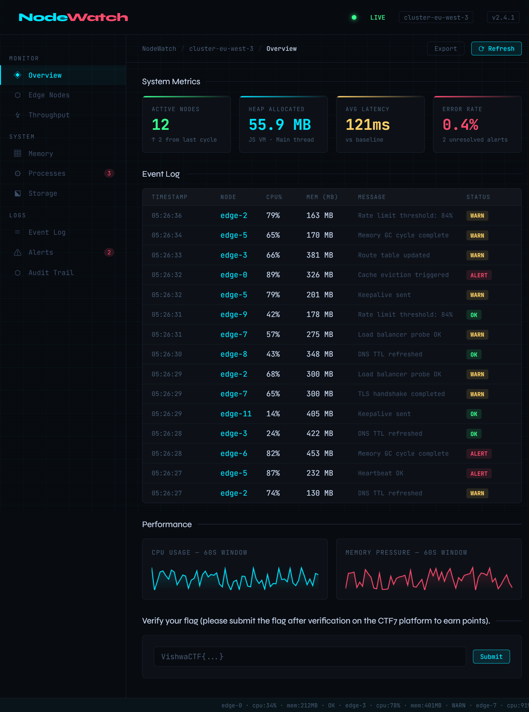
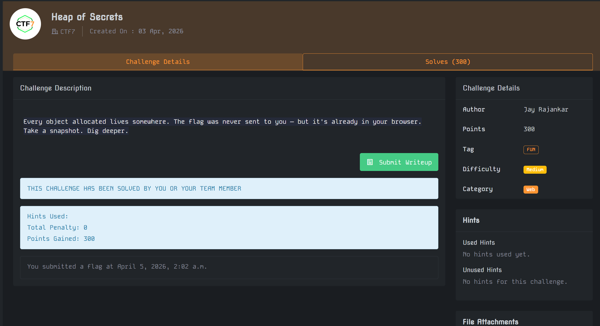

---
ctf_name: VishwaCTF 2026
challenge_name: Heap of Secrets
category: web
difficulty: medium
author: arkazq
date: 2026-04-05
tags: [Heap Snapshot, JavaScript, XOR]
---

# Heap of Secrets

## 1. 개요 및 분석 방향

문제 설명에서 `Every object allocated lives somewhere`, `Take a snapshot` 이라는 문구가 나와서, 처음부터 브라우저 메모리 쪽을 먼저 의심했다.  
페이지 자체는 실시간 telemetry 대시보드처럼 보이기 때문에 처음에는 로그 데이터 쪽으로 시선이 가지만, 문제 설명상 핵심은 화면에 보이는 값이 아니라 브라우저 내부 상태라고 판단했다.



## 2. 초기화 데이터 확인

처음에는 Heap snapshot에서 바로 `flag` 문자열을 찾으려 했지만 노이즈가 많아서 바로 유의미한 값을 찾기 어려웠다.  
그래서 페이지가 처음 로드될 때 어떤 요청을 보내는지 확인했고, `/api/init` 응답에서 `session_seed` 와 `trace_vector` 라는 수상한 값이 보였다.

```json
{
  "session_seed": 60,
  "trace_vector": [106, 85, 79, 84, 75, 93, 127, 104, 122, 71, 84, 15, 8, 76, 99, 9, 82, 8, 76, 9, 84, 12, 72, 99, 13, 79, 99, 120, 15, 89, 76, 99, 113, 15, 81, 12, 78, 69, 65]
}
```

`telemetry` 응답은 단순 로그처럼 보였지만, `init` 응답의 위 두 값은 UI 표시용 데이터라기보다 별도의 계산에 쓰일 값처럼 보였다.

## 3. Heap snapshot과 함수 확인

다시 Heap snapshot 쪽에서 `initSession` 함수를 찾았고, 함수 내용을 보니 `trace_vector` 를 `session_seed` 로 XOR 해서 문자열을 만든 뒤 `session.license_token` 에 저장하고 있었다.

```js
const key     = data.session_seed;
const decoded = data.trace_vector.map(b => b ^ key);
const token   = decoded.map(c => String.fromCharCode(c)).join("");
session.license_token = token;
```

따라서 굳이 손으로 끝까지 복원하지 않아도, 이미 브라우저 객체에 저장된 값을 확인하면 된다고 판단했다.

## 4. 세션 객체 확인 및 플래그 획득

콘솔에서 `__allocator.sessions[0].license_token` 을 확인하니 플래그가 그대로 저장되어 있었다.

```js
__allocator.sessions[0].license_token
```

문제 페이지 하단의 입력란에 해당 값을 넣어 검증도 할 수 있었다.



최종 플래그:

```text
VishwaCTF{REDACTED}
```
